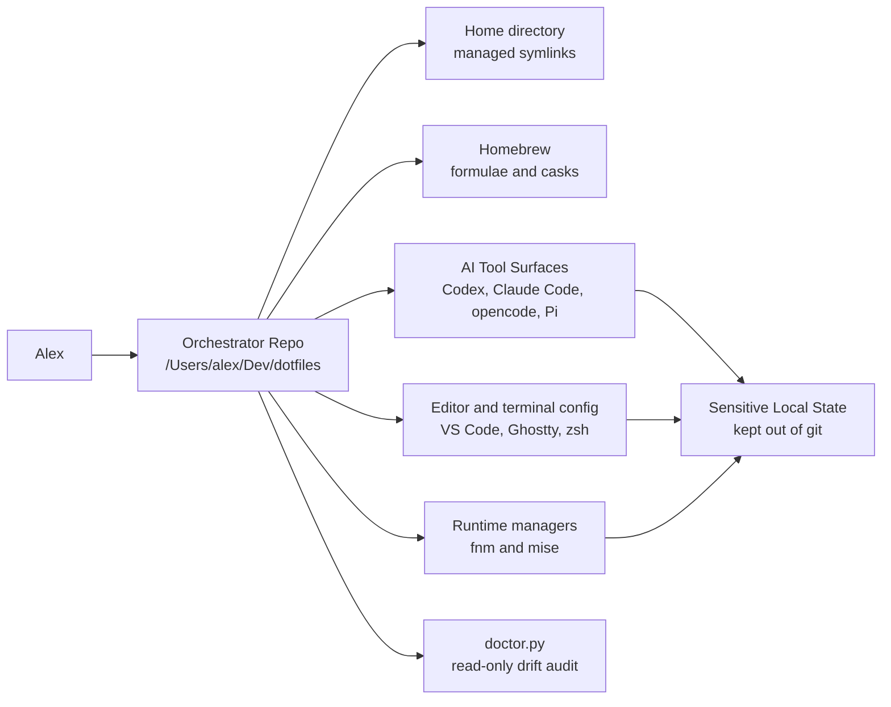
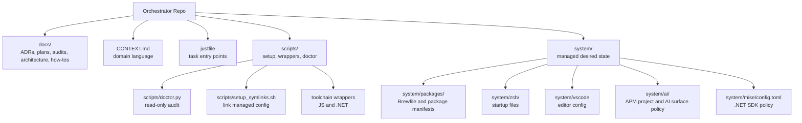

# Development Ecosystem Architecture

This page describes the current shape of the Development Ecosystem managed by
this Orchestrator Repo. It is intentionally lightweight: use ADRs for durable
decisions, plans for implementation work, and package manifests for exact
installable state.

## Goals

- Reproduce a macOS development laptop from versioned, reviewable sources.
- Keep install provenance visible for tools, runtimes, editors, AI surfaces, and
  security utilities.
- Separate managed configuration from Sensitive Local State.
- Make drift observable before cleanup or migration work runs.
- Keep global tooling useful across projects without turning this repo into a
  dumping ground for project-specific preferences.

## Non-Goals

- This repo does not own credentials, auth state, histories, local databases,
  trusted-project lists, app caches, or generated runtime state.
- This repo does not vendor every external asset. Companion Repos and package
  sources can remain separate when they have their own lifecycle.
- This repo does not make cleanup implicit. Destructive or credential-adjacent
  changes need a Reset Approval Gate.

## Context

Scope: one user's macOS Development Ecosystem.

Notation: boxes are major systems or state locations. Arrows mean "declares",
"links", "installs", "configures", or "audits" depending on the target label.
Sensitive Local State is intentionally outside the repo even when the repo
documents its boundary.

## Building Blocks

## Runtime View

Bootstrap and repair work flows through explicit tasks:

1. `just bootstrap` installs declared packages, installs tool globals, configures
   security/network helpers, backs up existing config, and links managed files.
2. `scripts/setup_symlinks.sh` links selected files from `system/` into the
   expected home-directory locations.
3. `just doctor` runs `scripts/doctor.py` as a read-only audit against manifests,
   local commands, and known drift classifications.
4. Toolchain wrappers such as `scripts/js_toolchain.sh` and
   `scripts/dotnet_toolchain.sh` force commands through the selected runtime
   owners instead of accepting accidental PATH winners.

The current runtime ownership model is:

| Area | Owner | Source |
| --- | --- | --- |
| macOS packages and apps | Homebrew | `system/packages/Brewfile` |
| Node runtime and global JS tools | `fnm` plus Corepack/pnpm | ADR-0007, `pnpm-global.txt` |
| .NET SDKs | `mise` | ADR-0006 and `system/mise/config.toml` |
| .NET global tools | `mise`-managed `dotnet` | `system/packages/dotnet-tools.txt` |
| AI shared assets | APM | ADR-0008 and `system/ai/apm/` |
| Editor settings | symlinked repo files | `system/vscode/` |
| Shell startup | symlinked zsh files | ADR-0004 and `system/zsh/` |

## Deployment View

The repo is deployed by symlink and package-manager side effects:

- source files live under `/Users/alex/Dev/dotfiles`;
- a stable `~/.dotfiles` symlink points back to the repo;
- managed config files are symlinked into home and application config paths;
- Homebrew installs formulae and casks from `system/packages/Brewfile`;
- pnpm and .NET global tools are installed from their manifests through the
  selected runtime wrappers;
- APM project files are symlinked to `~/.apm` and can materialize approved AI
  baseline output into target AI surfaces.

Generated outputs, caches, logs, credentials, and local databases remain outside
the source-of-truth boundary unless a future ADR explicitly changes ownership.

## Cross-Cutting Concepts

Source of truth:
The repo owns desired state through tracked files. A local tool is either
declared, intentionally local, a Managed Exception, or an approval-gated cleanup
candidate.

Sensitive Local State:
Credentials, histories, trusted-project lists, caches, app databases, auth files,
and account-specific config stay out of git. Docs may describe their shape or
safe setup path, but should not copy their raw contents.

Approval gates:
Removal, migration, reset, target-write, and credential-adjacent operations need
explicit approval. Plans and manual-state docs should name those gates rather
than hiding them inside bootstrap commands.

Read-only audit first:
`just doctor` reports drift and provenance without changing the machine. Use it
before deciding whether to declare, exempt, migrate, or remove local state.

Decision records:
Durable ownership decisions belong in ADRs. Routine task sequences belong in
how-to guides or plans.

## Key Decisions

- ADR-0001: this repo is the Development Ecosystem Orchestrator.
- ADR-0004: zsh is the primary interactive/editor shell.
- ADR-0006: `mise` owns .NET SDK selection.
- ADR-0007: `fnm` owns Node and the JS toolchain path.
- ADR-0008: APM owns shared AI Assets, while AI binaries remain tool surfaces.
- ADR-0010: Bruno and HTTPie own API development.
- ADR-0011: VS Code plus dedicated agents replace Cursor.

## Current Risks

- Root README content can drift from current ADR and package policy because it
  still contains long-form setup and tool descriptions.
- Some older ADRs predate the current ADR quality guide and are intentionally
  less structured than new records should be.
- Historical audits and plans can preserve old observations after cleanup has
  completed. Prefer `just doctor`, package manifests, and current ADRs for live
  state.
- Stale package receipts can outlive removed files. Treat them as informational
  unless doctor or an installer reports actionable drift.

## Related Docs

- [`README.md`](../README.md): quick start and main entry point.
- [`CONTEXT.md`](../CONTEXT.md): glossary and domain language.
- [`docs/adr/`](adr/): durable decision records.
- [`docs/plans/`](plans/): stabilization and migration plans.
- [`system/packages/README.md`](../system/packages/README.md): package manifest
  contracts.
- [`system/ai/README.md`](../system/ai/README.md): AI Tool Surface and AI Asset
  policy.
